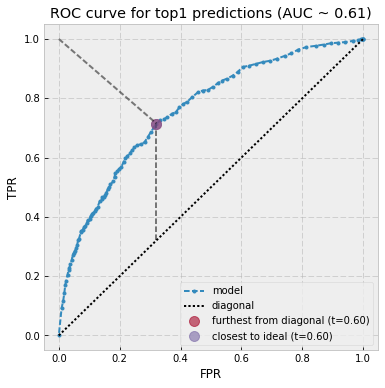

# Tweet image labeling demo 

This repo comprises a collection of code and procedures for applying a pre-trained image classification model (VGG16, trained on ImageNet) to images in a curated corpus of Tweets, and then analyzing the results to calculate some evaluation metrics. 

----


1. Build Python environment

The libraries used in this work have likely had newer releases since this work. To recreate this work, use the `pip-freeze.txt` library file. Otherwise, consider using the latest releases of all the items listed in the `requirements.txt` file, and be prepared to fix things to accomodate any API changes. Note: all of this code was developed on Ubuntu 14.04 on a remote server. Shell commands are assume we're in the root dir of this repo. 

```bash
$ # to reproduce exactly... 
$ mkvirtualenv -p `which python3.5` img 
(img) $ export TF_BINARY_URL=https://storage.googleapis.com/tensorflow/linux/cpu/tensorflow-0.11.0-cp35-cp35m-linux_x86_64.whl
(img) $ pip install -r pip-freeze.txt
```


2. Collect Tweets

The data collection is custom, so some of this isn't particularly portable for the rest of the world. Plus-or-minus updating the filepaths and commenting out things related to `waitForNProcs`, it should be still be roughly correct. The output of this script is the newline-delimited file of all the relevant Tweets `data/tweets.json`. 

```bash
$ nohup nice bash bin/get-archive-tweets.bash > log/collect-sampled-tweets.log &  
```


3. Apply image classification model 

The Python script wraps (and modifies) a bunch of example snippets from the [Keras docs](https://keras.io/applications/#usage-examples-for-image-classification-models) in order to work on JSON Tweet data, and decouple some of the helper functions that are built in to Keras. 

The args to the Python script specify the pretrained model (VGG16 is the only one implemented), and the number (k) of predictions to output for each image. The output of this script is a CSV of `tweet_id, link, label_1, score_1, ..., score_k` rows, which is currently hand-configured in the `output_results()` method. In my use, the script outputs predictions at a rate of about two images per second. 

```bash
(img) $ nohup cat data/tweets.json | nice python bin/label_images.py -m vgg16 -k 5 2> log/preds.log > rdata/preds.csv &
```


4. Create and load MySQL tables

If MySQL isn't already installed and running on your system, figure that out first. Assuming we have root privileges in our local mysql server, we'll create the necessary db and tables, in addition to a custom user who can read and write to these tables. You can change the app user name as desired (in both the `.sql` and `.py` scripts). 

```bash
(img) $ mysql -u root < db/create_schema.sql
(img) $ nohup cat rdata/preds.csv | nice python db/load_data.py > log/db-load.log 2>&1 &
```


5. Run webapp and evaluate classifications

The web interface is a Flask app that runs locally and talks to the (also local) MySQL db that we loaded in the previous step. To enable the app to run (on local port 5000, the Flask default), we would nominally just run `(img) $ nohup flask run` from the `webapp` directory. But a) this work was done on a remote server, and b) I wanted verbose logging. So, first we forward our local port 5000 to the remote port 5000 (where Flask will listen for requests), activate the virtualenv, start the Flask app in debug mode, and then background the (nohup'd) task so the web server stays running when we need to take a break from scoring. 

```bash
$ ssh -L 5000:localhost:5000 <you>@<remote-server>  # on local machine
$ cd webapp/                                        # on remote machine 
$ workon img                    
(img) $ export FLASK_APP=app.py; export FLASK_DEBUG=1; nohup nice flask run > ../log/prod-webapp-predictions.log &
```

Now we can open `localhost:5000` in your local browser (I used Chrome), and we should get our first image along with the top-k (5, by default) predictions. We can click the buttons to score the predictions (is the top image label prediction correct? is something in the top five correct? are none of them correct?), or use the (hard-coded) keyboard bindings (j, k, and l, respectively) to store the rating and load the next image. 

Keep going until out of predictions or tired of evaluating.  


6. Export results for analysis

Whenever we're done scoring image predictions and updating the results db, we can export the results to TSV for analysis.

```bash
$ nohup nice mysql -u root image_labels < db/export_results.sql > rdata/db-results-export.tsv &
```


7. Analyze prediction results

Using the exported tsv, we can run some analysis on our predictions to understand how the model performed. Again, since we're running this on a remote server, you'll need to forward a local port of your choosing to the remote host for the IPython notebook server. Assuming we update the filepath at the top of the notebook correctly, we can possibly just hit "Run All" and see what happens. 

The important figure is the ROC curve shown below, where this particular evaluation suggests a prediction probability threshold of 0.6 is a good choice. A rendered version of the notebook from the original experiment [is here](https://gist.github.com/jrmontag/ad759915531c91a7becb9cfaaf66a15c). 

```bash 
(img) $ jupyter notebook --no-browser --port=<forwarded port>
```

 


8. Profit?  

